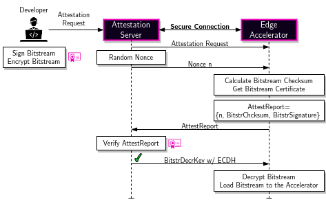

## FPGA Remote Attestation Example

FPGA Remote Attestation example for PCI Express - CPU Setup (ie. x86 CPU hosting an ALVEO Card). 
The Remote remote attestation has been done by utilizing the ```xclbinutil``` Xilinx/AMD provides for Accelerator Cards.
Futhermore, an external verification server is needed t operform the remote attestation request and verify the received values.


